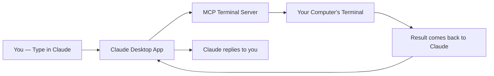
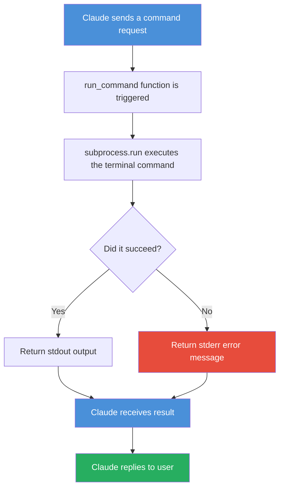
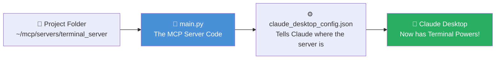

# 🖥️ Building Your First MCP Terminal Server — Step-by-Step Guide

> **Who is this for?** Students with some basic coding knowledge who want to build and connect their own MCP (Model Context Protocol) server to Claude.

---

## 📌 What is an MCP Server?

An **MCP Server** is a small program that gives Claude new "tools" or "abilities".

Think of it like this:
> Claude is a smart assistant, but by default it can only *talk*. An MCP server gives Claude *hands* — the ability to actually **do things** on your computer, like running terminal commands.

In this guide, we will build a **Terminal MCP Server** — which lets Claude run real terminal/shell commands on your computer on your behalf.

---

## 🗺️ What Are We Building? (Big Picture)



**In plain English:**
1. You ask Claude something
2. Claude realizes it needs to run a terminal command
3. It calls your MCP server
4. Your MCP server runs the command on your computer
5. The result goes back to Claude
6. Claude explains it to you

---

## 🛠️ Prerequisites

Before starting, make sure you have:

| Tool | What it is | Download |
|------|-----------|----------|
| **Claude Desktop** | The Claude app on your computer | [claude.ai/download](https://claude.ai/download) |
| **VS Code** | Code editor | [code.visualstudio.com](https://code.visualstudio.com) |
| **Python** | Programming language | [python.org](https://python.org) |

---

## 📁 Step 1: Create the Project Folders

We need two folders:
- `terminal_server` → where our code lives
- `workspace` → where Claude will run commands

### 🍎 Mac
```bash
mkdir -p ~/mcp/servers/terminal_server
mkdir -p ~/mcp/workspace
```

### 🪟 Windows (PowerShell)
```powershell
New-Item -ItemType Directory -Force -Path "$env:USERPROFILE\mcp\servers\terminal_server"
New-Item -ItemType Directory -Force -Path "$env:USERPROFILE\mcp\workspace"
```

> 💡 **What does this do?**
> `mkdir -p` creates folders. The `-p` flag means "create all parent folders too, don't throw an error if they already exist."
> On Windows, `New-Item` does the same thing.

---

## 📂 Step 2: Navigate Into the Project Folder

### 🍎 Mac
```bash
cd ~/mcp/servers/terminal_server
```

### 🪟 Windows (PowerShell)
```powershell
cd "$env:USERPROFILE\mcp\servers\terminal_server"
```

> 💡 **What does this do?**
> `cd` stands for "change directory" — it moves you into the folder you just created.

---

## ⚡ Step 3: Install `uv` (Python Package Manager)

`uv` is a super fast Python tool manager. We use it instead of the default `pip` because it's faster and handles project environments cleanly.

### 🍎 Mac
```bash
curl -LsSf https://astral.sh/uv/install.sh | sh
```

### 🪟 Windows (PowerShell)
```powershell
powershell -ExecutionPolicy ByPass -c "irm https://astral.sh/uv/install.ps1 | iex"
```

> 💡 **What does this do?**
> Both commands download and run the `uv` installer from the internet directly into your system.

After installation, verify it worked:
```bash
uv --version
```
You should see something like: `uv 0.9.3`

---

## 🚀 Step 4: Initialize the Project

```bash
uv init
```

> 💡 **What does this do?**
> `uv init` sets up your project — it creates a `pyproject.toml` file (a config file that tracks your project name, Python version, and dependencies).

---

## 🐍 Step 5: Create a Virtual Environment

### 🍎 Mac & 🪟 Windows
```bash
uv venv
```

Then **activate** the environment:

### 🍎 Mac
```bash
source .venv/bin/activate
```

### 🪟 Windows (PowerShell)
```powershell
.venv\Scripts\activate
```

> 💡 **What is a virtual environment?**
> Imagine it as a **clean room** just for this project. Any packages you install stay inside this room and don't affect the rest of your computer. When activated, you'll see `(terminal_server)` appear at the start of your terminal line.

---

## 📦 Step 6: Install the MCP Package

```bash
uv add "mcp[cli]"
```

> 💡 **What does this do?**
> This installs the `mcp` library — the toolkit that lets you build MCP servers. The `[cli]` part installs extra command-line tools that come with it.

You'll see a list of packages being installed. That's normal!

---

## 💻 Step 7: Write the Code

Open VS Code in your project folder:
```bash
code .
```

Create a new file called `main.py` and paste this code:

```python
import os
import subprocess
from mcp.server.fastmcp import FastMCP

mcp = FastMCP("terminal")
DEFAULT_WORKSPACE = os.path.expanduser("~/mcp/workspace")

@mcp.tool()
async def run_command(command: str) -> str:
    """
    Run a terminal command inside the workspace directory.
    If a terminal command can accomplish a task,
    tell the user you'll use this tool to accomplish it,
    even though you cannot directly do it

    Args:
        command: The shell command to run.

    Returns:
        The command output or an error message.
    """
    try:
        result = subprocess.run(command, shell=True, cwd=DEFAULT_WORKSPACE, capture_output=True, text=True)
        return result.stdout or result.stderr
    except Exception as e:
        return str(e)

if __name__ == "__main__":
    mcp.run(transport='stdio')
```

---

## 🧠 Understanding the Code (Non-Coder Friendly)

Let's break this down piece by piece. No jargon!

---

### 🔷 Part 1: Importing Tools

```python
import os
import subprocess
from mcp.server.fastmcp import FastMCP
```

> Think of this like getting your equipment ready before cooking.
> - `os` → helps work with your computer's file system (folders, paths)
> - `subprocess` → lets Python actually **run terminal commands**
> - `FastMCP` → the framework that turns this script into an MCP server

---

### 🔷 Part 2: Creating the Server

```python
mcp = FastMCP("terminal")
DEFAULT_WORKSPACE = os.path.expanduser("~/mcp/workspace")
```

> - `FastMCP("terminal")` → creates your server and names it "terminal"
> - `DEFAULT_WORKSPACE` → sets the folder where all commands will be run. `os.path.expanduser("~")` converts `~` to your actual home folder path (like `/Users/ashumishra`)

---

### 🔷 Part 3: The Tool (The Heart of the Server)

```python
@mcp.tool()
async def run_command(command: str) -> str:
```

> - `@mcp.tool()` → this is a **decorator**. It tells the MCP server: "Hey, this function is a tool Claude can use!"
> - `async def` → means this function can run without blocking other things (like a waiter who can serve multiple tables)
> - `command: str` → the function accepts one input: a terminal command (text)
> - `-> str` → it will return text back

---

### 🔷 Part 4: Running the Command

```python
try:
    result = subprocess.run(command, shell=True, cwd=DEFAULT_WORKSPACE, capture_output=True, text=True)
    return result.stdout or result.stderr
except Exception as e:
    return str(e)
```

> - `subprocess.run(...)` → actually runs the terminal command
> - `shell=True` → runs it through the system shell (like typing in terminal)
> - `cwd=DEFAULT_WORKSPACE` → runs it inside the workspace folder
> - `capture_output=True` → captures what the command prints
> - `result.stdout` → the normal output of the command
> - `result.stderr` → error output (if something went wrong)
> - `except` → if anything crashes, return the error message instead of crashing the server

---

### 🔷 Part 5: Starting the Server

```python
if __name__ == "__main__":
    mcp.run(transport='stdio')
```

> - `if __name__ == "__main__"` → only run this when the file is executed directly (not when imported)
> - `mcp.run(transport='stdio')` → starts the server using **stdio** (standard input/output) — this is how Claude Desktop talks to MCP servers

---

### 📊 Code Flow Diagram



---

## ⚙️ Step 8: Configure Claude Desktop

Now we need to tell Claude Desktop where to find our MCP server.

### 🍎 Mac — Config File Location
```
~/Library/Application Support/Claude/claude_desktop_config.json
```

Open it with:
```bash
open ~/Library/Application\ Support/Claude/
```

### 🪟 Windows — Config File Location
```
%APPDATA%\Claude\claude_desktop_config.json
```

Open it with:
```powershell
explorer $env:APPDATA\Claude\
```

---

### 📝 Config File Content

#### 🍎 Mac Version
```json
{
  "mcpServers": {
    "terminal": {
      "command": "uv",
      "args": [
        "run",
        "--with",
        "mcp[cli]",
        "mcp",
        "run",
        "/Users/YOUR_USERNAME/mcp/servers/terminal_server/main.py"
      ]
    }
  }
}
```
> ⚠️ Replace `YOUR_USERNAME` with your actual Mac username (run `whoami` in terminal to find it)

#### 🪟 Windows Version
```json
{
  "mcpServers": {
    "terminal": {
      "command": "uv",
      "args": [
        "run",
        "--with",
        "mcp[cli]",
        "mcp",
        "run",
        "C:\\Users\\YOUR_USERNAME\\mcp\\servers\\terminal_server\\main.py"
      ]
    }
  }
}
```
> ⚠️ Replace `YOUR_USERNAME` with your actual Windows username

---

## 🔁 Step 9: Restart Claude Desktop

Fully quit and reopen Claude Desktop so it loads the new config.

### 🍎 Mac
```
Cmd + Q → Reopen Claude
```

### 🪟 Windows
```
Right-click taskbar icon → Quit → Reopen Claude
```

---

## ✅ Step 10: Test It!

In Claude Desktop, type:

```
Please run terminal server, and tell me the configuration of my laptop
```

If everything is working, Claude will:
1. Identify it can use the `run_command` tool
2. Ask your permission to run a command
3. Execute it and return real results from your computer 🎉

---

## 🚨 Common Errors & Fixes

| Error | What it means | Fix |
|-------|--------------|-----|
| `zsh: command not found: $` | You copy-pasted the `$` sign | Don't include the `$` when typing commands |
| `source: no such file or directory: .venv/Scripts/activate` | Using Windows path on Mac | Use `source .venv/bin/activate` on Mac |
| `unrecognized subcommand 'addmcp[cli]'` | Missing space in command | Use `uv add "mcp[cli]"` with a space |
| MCP server not showing in Claude | Config file path is wrong | Double-check the file path in `claude_desktop_config.json` |

---

## 🎯 Summary — What You Built



Congratulations! You've built a real MCP server that gives Claude the ability to run terminal commands on your computer. This is the foundation for building much more powerful AI tools! 🚀

---

*Guide created for AI Product Management students | Feel free to share and adapt*
