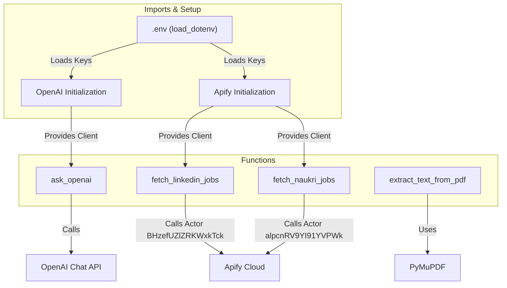

# helper.py Architecture

```mermaid
graph TD
    subgraph Imports & Setup
        Env[".env (load_dotenv)"]
        OpenAI_Setup[OpenAI Initialization]
        Apify_Setup[Apify Initialization]
    end

    subgraph Functions
        PDF[extract_text_from_pdf]
        GPT[ask_openai]
        LinkedIn[fetch_linkedin_jobs]
        Naukri[fetch_naukri_jobs]
    end

    Env -->|Loads Keys| OpenAI_Setup
    Env -->|Loads Keys| Apify_Setup

    OpenAI_Setup -->|Provides Client| GPT
    Apify_Setup -->|Provides Client| LinkedIn
    Apify_Setup -->|Provides Client| Naukri

    PDF -->|Uses| Fitz[PyMuPDF]
    
    GPT -->|Calls| OpenAI_API[OpenAI Chat API]
    LinkedIn -->|Calls Actor BHzefUZlZRKWxkTck| Apify_Actor[Apify Cloud]
    Naukri -->|Calls Actor alpcnRV9YI91YVPWk| Apify_Actor
```
