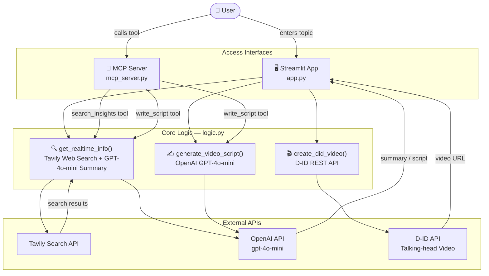

# StoryForge MCP

An AI-powered video script generator with D-ID video creation, exposed both as a Streamlit web app and an MCP (Model Context Protocol) server for use directly inside Claude Desktop.

---

## Features

- **Real-time research** on any topic via Tavily search
- **AI script generation** using OpenAI GPT-4o-mini (100–120 word short video scripts)
- **AI video creation** using D-ID (talking-head avatar videos)
- **MCP server** — use the tools directly from Claude Desktop
- **Streamlit UI** — browser-based interface for non-technical users

---

## Architecture



---

## Project Structure

```text
Storyforge-mcp/
├── app.py            # Streamlit web UI
├── mcp_server.py     # FastMCP server (Claude Desktop integration)
├── logic.py          # Core functions: search, script, video
├── main.py           # Entry point placeholder
├── pyproject.toml    # Project dependencies
└── requirements.txt  # pip-compatible dependency list
```

---

## Setup

### 1. Install dependencies

```bash
uv sync
# or
pip install -r requirements.txt
```

### 2. Set environment variables

Create a `.env` file:

```env
OPENAI_API_KEY=your_openai_key
TAVILY_API_KEY=your_tavily_key
DID_API_KEY=your_did_api_key
```

### 3. Run the Streamlit app

```bash
streamlit run app.py
```

### 4. Use as an MCP server in Claude Desktop

Add to your `claude_desktop_config.json`:

```json
"StoryForge": {
  "command": "/path/to/.venv/bin/python",
  "args": ["/path/to/Storyforge-mcp/mcp_server.py"],
  "env": {
    "OPENAI_API_KEY": "your_openai_key",
    "TAVILY_API_KEY": "your_tavily_key"
  },
  "cwd": "/path/to/Storyforge-mcp"
}
```

---

## MCP Tools

| Tool | Description |
|------|-------------|
| `search_insights(query)` | Research any topic and return an AI-summarised brief |
| `write_script(topic)` | Research a topic and generate a 100–120 word video script |

---

## Tech Stack

| Layer             | Technology                  |
|-------------------|-----------------------------|
| UI                | Streamlit                   |
| MCP Framework     | FastMCP (via `mcp` package) |
| Research          | Tavily Search API           |
| Script Generation | OpenAI GPT-4o-mini          |
| Video Generation  | D-ID API                    |
| Runtime           | Python 3.12 + uv            |
